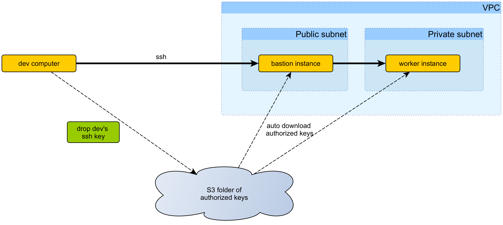
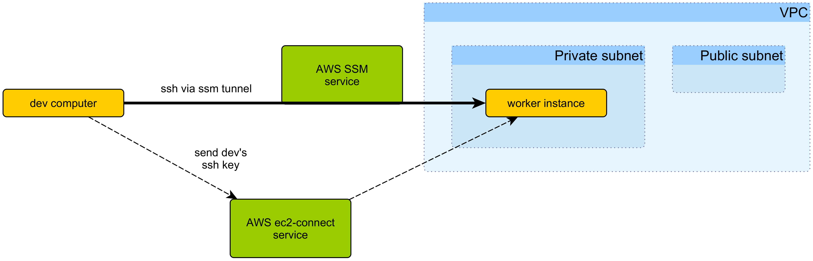

# Bastion or not Bastion ?

This about the pro and cons of using a bastion/jump host in order to access to an instance in a private subnet

## With Bastion/hump host


Resource requirement:
* VPC with private and public subnet
* A bastion/jump host instance is running in your public subnet
* An instance that your want to connect to in private subnet
* A S3 folder dedicated to hold allowed ssh key. 
* A script on your instance *and* bastion that periodically update the authorized ssh key list. 

How it work: you ssh into the bastion/jump host that is public facing then ssh into your instance. 

Your `~/.ssh/config` look like:
```
Host awsBastion 
    Hostname ec2-13-211-5-42.ap-southeast-2.compute.amazonaws.com
    User ubuntu   
    IdentityFile /your/key/to/bastion.pem

Host *.ap-southeast-2.compute.internal
    User ubuntu
    ProxyCommand ssh -l ubuntu awsBastion -W %h:%p
    IdentityFile /your/key/to/instance.pem
```

To connect, you run:
```
ssh xxxx.ap-southeast-2.compute.internal
```

## Without Bastion/Jump host


Resource requirement:
* VPC with private and public subnet
* An instance that you want to connect to, in a private subnet

How it work: you ask AWS Sesion-Manager to estalish a ssh tunnel from your instance to your local machine. Then you ssh into your instance via the tunnel.

Your `~/.ssh/config` look like:
```
Host i-* 
    User ubuntu
    ProxyCommand sh -c "aws ec2-instance-connect send-ssh-public-key --instance-id %h --instance-os-user %r --ssh-public-key 'file://~/.ssh/id_rsa.pub' --output text && aws ssm start-session --target %h --document-name AWS-StartSSHSession --parameters 'portNumber=%p'"
```

To connect, you run:
```
AWS_PROFILE=aws-cli-profile ssh i-014322b06bb5e5f76
```

# Pro using SSM (without bastion/jump host)
* More secure: 
  * you do not have a bastion/jump host exposed to internet
  * minor: your instance can have a Security-group that is fully closed: not inbound port is needed. Not even port 22. 
  But your instance is already in a private subnet so this do not add much more security
* More access trace and log: every time a ssh connection is opened, a SSM `StartSession` is created and will be logged the CloudTrail, 
  with the IAM user (and the access key) attached to it. Using bastion, only the syslog in the bastion will have trace, all under ubuntu user. 
* No bastion instance to manage. 
* No S3 folder containing individuals ssh key (and the permission around it)
* No custom script to download and update authorized keys

## Different way to controll who is allowed to ssh into your private instance
The list of user allowed to access to your private instance is defined by :
* In the case **with bastion**: the list of people allowed to drop their ssh key into the S3 ssh key folder.
* In the case **with ssm**: the list of IAM user with the permission ```ssm:StartSession``` and ```ec2-instance-connect:SendSSHPublicKey```

# Cons using SSM
* Your local device, from which you want to ssh to your instance, needs : 
  * ```aws cli``` installed.
  * ```Session Manager plugin``` : see https://docs.aws.amazon.com/systems-manager/latest/userguide/session-manager-working-with-install-plugin.html


# Todo for the sysadmin to setup without bastion
* Create a VPC with public and private subnet
* Make sure your instance profile have at least the permission `AmazonSSMManagedInstanceCore`.
* Make sure that all instance have:
    * SSM Agent installed, which is the default with AMIs based on Ubuntu and Amazon Linux
    * `ec2-instance-connect` package installed, which is the default with AMIs based on Ubuntu and Amazon Linux
* Create a user group `Access to instance` that contain the policy:
```
{
    "Version": "2012-10-17",
    "Statement": [
        {
            "Effect": "Allow",
            "Action": "ssm:StartSession",
            "Resource": [
                "arn:aws:ec2:$REGION:$ACCOUNTID:instance/*",
                "arn:aws:ssm:*:*:document/AWS-StartSSHSession"
            ]
        },
        {
            "Effect": "Allow",
            "Action": [
                "ec2-instance-connect:SendSSHPublicKey"
            ],
            "Resource": [
                "arn:aws:ec2:$REGION:$ACCOUNTID:instance/*"
            ]      
        }
    ]
}
```
* Add desired users to that group.


Resource:
* Different way to connect to your instance: https://carriagereturn.nl/aws/ec2/ssh/connect/ssm/2019/07/26/connect.html
* ssh via SSM but with your own ssh key rather than shared key: https://cloudonaut.io/connect-to-your-ec2-instance-using-ssh-the-modern-way/
